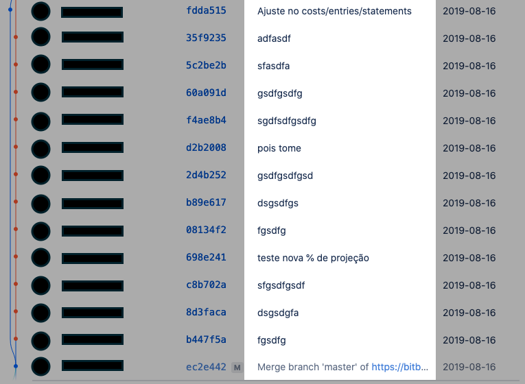

Quem me conhece bem sabe que minha memória é tão boa quanto a de um peixinho dourado. Só que por algum motivo obscuro minha cabeça guarda algumas coisas de uma forma tão viva que eu não consigo entender.

Recentemente eu lembrei de um pobre colega de trabalho que ficou uma noite inteira trabalhando para refazer um trabalho que ele tinha levado uma fucking semana para fazer. 

Sim, ele foi forçado a fazer em uma noite o trabalho de uma semana!!

Lá pra 2007-2008 o código de todos os projetos da empresa que eu trabalhava ficavam em um servidor compartilhado na rede e a gente programava direto dentro do servidor. 

Isso tem uma explicação simples: era a forma que a gente conhecia de trabalhar mais de uma pessoa no mesmo projeto.

Imagina a merda que seria cada um ter o projeto na sua máquina e depois ter que consolidar tudo que foi feito e modificado em cada arquivo antes de subir para produção!

Acontece que um outro ~~jumento~~ nobre colega achou que alguns arquivos não eram mais essenciais e saiu sapecando o DELETE neles, e quando você exclui arquivos pela rede, meu amigo e minha amiga, não tem lixeira não, tudo é apagado real oficial.

Não importa quanto tempo de experiência ou a linguagem de programação, todos nós vamos passar pelos mesmos problemas:

* Seu computador var dar pau no HD e você vai perder todo trabalho;<br /><br />
* Você vai subir uma nova feature para produção, perceber que ela está com vários bugs e não vai ter uma maneira rápida voltar ao último estado em que o código funcionava corretamente;<br /><br />
* Você vai começar a programar uma nova feature e do nada vão mandar você parar para resolver um problema e vai ser um parto mandar isso para produção pois no meio da correção do bug tem código da feature inacabada;<br /><br />
* Você vai fazer modificações em um arquivo e alguém da sua equipe vai editar o mesmo arquivo e vai sobrescrever o que você fez;<br /><br />
* Você vai começar a trabalhar em uma solução e vai ver que ela não funciona como imaginava, porém você já modificou tantos arquivos que fica extremamente dificil voltar atrás;

A gente sabe que a vida de programador é cheia de emoções, mas é sempre bom evitar mais uma, né? 


Por isso a comunidade criou o que chamamos de Sistema de Controle de Versão e o principal deles é o **Git**.

## Conteúdo

O objetivo principal desse artigo é servir de um guia para sempre que eu precisar lembrar de algum detalhe do funcionamento do Git ou de algum comando eu tenha uma forma fácil de pegar a informação.

Para facilitar a leitura e posteriormente a busca do que preciso, dividi o artigo da seguinte forma.

1. **O que é Git**:<br />
Aqui eu explico o que é e falo beeeem por cima dos primeiros conceitos;<br />
2. **O básico para você começar a usar**:<br />
Aqui eu começo a destrinchar os comandos básicos, aqueles que a gente sempre vê em todo artigo sobre Git, mas eu vou explicar da forma que ficou mais fácil eu entender;
3. **Trabalhando com Git do jeito certo**:<br />
Nessa seção eu falo de fluxos de trabalho e organização. Nem tudo no Git são comandos. Se você não seguir esses passos você e sua equipe terão vários problemas;<br />
4. **Avançando mais um pouquinho**<br />
Para conseguir trabalhar do jeito certo é preciso entender o Git um pouco mais a fundo.<br />
4. **Aprendendo a consertar cagadas**:<br />
Já aqui eu vou explicar comandos que podem salvar seu dia ou que vão te dar apoio para você aplicar os conceitos da seção anterior;<br />
5. **Referências rápidas**:<br />
Como a ideia do artigo é servir de guia eu vou dedicar essa seção para listagem de comandos e explicação rápida para apenas copiar e colar 😬<br />

## O que é Git 

Como os problemas que você tem hoje são os mesmos que eu tive em 2008, e que são os mesmos que as pessoas tem desde a década de 80, começou a surgir o que chamamos de Sistemas de Controle de Versão (em inglês Version Control System - VCS).

Eu não vou gastar meus dedos escrevendo sobre a história do Git e qual a sua diferença em relação os demais VCS's. Não é o objetivo desse artigo e você pode ver isso muito bem explicado [nesse vídeo do Fabio Akita](https://www.youtube.com/watch?v=6Czd1Yetaac).

O importante aqui é você saber que o Git é uma ferramenta que te permite **gerenciar versões do seu código**. 

Isso significa que cada vez que você começa a escrever e informa ao Git que concluiu a modificação no código, ele guarda uma foto do projeto **inteiro** naquele momento. Isso seria uma *versão* do código.

Se por qualquer motivo você precisa resgatar o estado do projeto em um determinado ponto, você só precisa dizer para o Git qual foto que você deseja e ele recria o projeto inteiro com todos os arquivos exatamente como eles estavam no momento que a foto foi tirada.

Daí você me pergunta "*Beleza, então como eu faço para retirar essas fotos e usá-las quando preciso?*". É aí que vem a segunda parte desse artigo.

## O básico para você começar a usar

Eu disse que essa seção eu falaria do básico mas não falei 100% a verdade.

Eu não vou te explicar como instalar o Git pois esse passo já está cheio de tutoriais na Internet, [inclusive no site oficial da ferramenta](https://git-scm.com/downloads).

### Iniciando o Git

Uma vez instalado o primeiro passo é você informar ao Git que você quer começar a versionar o seu projeto. Para isso você deve entrar na pasta do projeto e dentro dele digitar o comando `git init`.

**Exemplo:**

```bash
$ cd projeto-garotão 

$ git init
Initialized empty Git repository in /Users/brunoviana/htdocs/projeto-garotão/.git/
```

Isso vai criar uma pasta `.git` na raíz do projeto. Como o nome do diretório começa com ponto ele ficará naturalmente oculto, mas se executar `ls -1a` para exibir os arquivos em lista incluindo os ocultos você consegue vê-lo.

```bash
$ ls -1a
.
..
.git
```

Nesse diretório fica todo o controle do projeto, isso significa que se você copiar e colar em outro diretório, ou até mesmo em outro computador, você tem acesso ao histórico do projeto inteiro.

### Começando a guardar as fotos

Uma vez que você começa a trabalhar o Git vai definindo estados aos arquivos. Vou usar o meu projeto de exemplo para poder explicar. 

Antes de começar eu vou usar o comando `git status` para me dar uma visão geral de como estão os meus arquivos.

```bash
$ git status   

On branch master

No commits yet

nothing to commit (create/copy files and use "git add" to track)
```
Basicamento o Git me disse, na linha 5, que não tem nenhuma foto batida. Essas fotos ele chama de **Commits** e é assim que vou chamar a partir de agora. 

Ele também me diz que não tenho nenhum arquivo modificado. 

Vamos começar a modificar para ver o que ele vai dizer.

Ah, por enquanto ignora as demais informações do `git status` que elas farão sentido mais pra frente.

```bash
$ echo 'versão 1' > teste.txt

$ git status

On branch master

No commits yet

Untracked files:
  (use "git add <file>..." to include in what will be committed)

	teste.txt

nothing added to commit but untracked files present (use "git add" to track)
```

Na linha 1 criei um simples arquivo chamado `teste.txt` com o conteúdo "versão 1" e depois executei, na linha 3, `git status` novamente.

Na linha 9, o Git lista todos os arquivos que estão "Untracked" (calma!) e me diz, bem ali na linha 12, que o meu arquivo `teste.txt` é um deles.

Arquivos **Untracked** são todos os arquivos que você modificou mas ainda não foram eleitos a serem gravados no próximo commit. Para fazer isso use o comando `git add nome-do-arquivo`.

```bash
$ git add teste.txt

$ git status       

On branch master

No commits yet

Changes to be committed:
  (use "git rm --cached <file>..." to unstage)

	new file:   teste.txt

```

Agora que rodei o comando (linha 1), o Git está me informando que o arquivo `teste.txt` possui modificações prontas para irem no próximo commit (linha 12). 

Dessa vez o seu estado é **Staged**, ou seja, este arquivo esta na **Staging Area**, uma área onde o Git separa todos os arquivos eleitos para irem no próximo commit.

Agora eu estou satisfeito com as modificações que fiz e finalmente vou fazer o commit usando o comando `git commit -m 'mensagem do commit'`.

```bash
$ git commit -m "criado teste.txt com versao 1"

[master (root-commit) b13ed54] criado teste.txt com versao 1
 1 file changed, 1 insertion(+)
 create mode 100644 teste.txt
```

Preste atenção na mensagem que passei no commit. Ela deve ser uma mensagem curta que informe de maneira clara o que você fez naquele commit.

Isso é extremamente importante pois quando você precisar ver o que foi feito para voltar para algum commit, você entender exatamente o contexto das modificações que tem lá.

Usando o comando `git log` a gente tem acesso a todos os commits feitos até aqui.

```bash
$ git log

commit b13ed54d3b9f92d7d4e5e0dc98e0d57798655c21 (HEAD -> master)
Author: Bruno Viana <brunoviana@gmail.com>
Date:   Thu Apr 16 10:30:13 2020 -0300

    criado teste.txt com versao 1
(END)
```

Observe na linha 7 a mensagem que usei aparecendo.

Agora, vamos olhar o status do nosso projeto novamente para ver como ele ficou.

```bash
$ git status

On branch master
nothing to commit, working tree clean
```

Agora vamos fazer uma segunda modificação e ver como fica os status do projeto.

```bash
$ echo 'versão 2' > teste.txt

$ git status

On branch master
Changes not staged for commit:
  (use "git add <file>..." to update what will be committed)
  (use "git checkout -- <file>..." to discard changes in working directory)

	modified:   teste.txt

no changes added to commit (use "git add" and/or "git commit -a")
```

Ótimo. 

Podemos ver que meu arquivo possui um novo estado chamado de **Modified**, isso significa que ele já existe no último commit, porém ele não é mais o mesmo pois sofreu alterações.

Isso significa que eu preciso usar o `git add` novamente para as alterações irem no próximo commit.

```bash
$ git add teste.txt

$ git commit -m "modifiquei arquivo teste.txt"

[master b49edc5] modifiquei arquivo teste.txt
 1 file changed, 1 insertion(+), 1 deletion(-)
```

Se eu rodar `git log` de novo verei que tem um novo commit.

```bash
$ git log

commit b49edc52ed20107b673ca9eae008527ef61c8091 (HEAD -> master)
Author: Bruno Viana <brunoviana@gmail.com>
Date:   Thu Apr 16 10:45:27 2020 -0300

    modifiquei arquivo teste.txt

commit b13ed54d3b9f92d7d4e5e0dc98e0d57798655c21
Author: Bruno Viana <brunoviana@gmail.com>
Date:   Thu Apr 16 10:30:13 2020 -0300

    criado teste.txt com versao 1
(END)
```

### Guardando alterações diferentes no mesmo arquivo

Se você fez uma alteração em um arquivo que já estava Staged o Git vai manter em Staging Area apenas as modificações que você adicionou.

Veja o exemplo abaixo.

```bash
$ echo 'versão 3' > teste.txt 

$ git status

On branch master
Changes not staged for commit:
  (use "git add <file>..." to update what will be committed)
  (use "git checkout -- <file>..." to discard changes in working directory)

	modified:   teste.txt

no changes added to commit (use "git add" and/or "git commit -a")

$ git add teste.txt 

$ echo 'versão 3.1' > teste.txt

$ git status

On branch master
Changes to be committed:
  (use "git reset HEAD <file>..." to unstage)

	modified:   teste.txt

Changes not staged for commit:
  (use "git add <file>..." to update what will be committed)
  (use "git checkout -- <file>..." to discard changes in working directory)

	modified:   teste.txt
```

Na linha 1 eu fiz uma terceira alteração. Na linha 3 eu consulto o status para garantir que meu arquivo ainda não estava em Staging.

Na linha 14 eu finalmente adiciono ele em Staging, porém eu resolvi fazer mais uma pequena modificação na linha 16 e na linha 18 consulto o status novamente.

Perceba que agora o Git me falou, na linha 24, que o arquivo `teste.txt` foi modificado e **está** em Staging. Também na linha 30 diz que o mesmo arquivo foi modificado e **não está** em Staging.

Parece confuso, mas faz todo sentido quando você entende que **o Git não guarda o arquivo inteiro em Staging, mas sim, as modificações linha a linha**.

Em outras palavras, na primeira vez que executei `git add` ele guardou o conteúdo "versão 3". Depois que modifiquei o arquivo o Git manteve em Staging a modificação com conteúdo "versão 3".

Se eu quisesse que no proximo commit fosse a modificação "versão 3.1", e não "versão 3", eu precisaria executar `git add novamente`.

Para efeitos didáticos vou commitar e ver o status.

```bash
$ git commit -m "commitando versão 3"

[master bd6052e] commitando versão 3
 1 file changed, 1 insertion(+), 1 deletion(-)

$ git status

On branch master
Changes not staged for commit:
  (use "git add <file>..." to update what will be committed)
  (use "git checkout -- <file>..." to discard changes in working directory)

	modified:   teste.txt

no changes added to commit (use "git add" and/or "git commit -a")
```
Como previamos, mesmo commitando o Git ainda me diz que tenho modificações para serem commitadas. Vou commitar mais uma vez.

```bash
$ git add teste.txt 

$ git commit -m "commitando versão 3.1 agora"

[master 06ef804] commitando versão 3.1 agora
 1 file changed, 1 insertion(+), 1 deletion(-)
 ```

Agora meu Git log está assim:

```bash
$ git log

commit 06ef8049b732ff991a6a20cf323d258869cc0545 (HEAD -> master)
Author: Bruno Viana <brunoviana@gmail.com>
Date:   Fri Apr 17 08:27:12 2020 -0300

    commitando versão 3.1 agora

commit bd6052e9055a18ccb18eff9563eca97ba0f9a35f
Author: Bruno Viana <brunoviana@gmail.com>
Date:   Fri Apr 17 08:12:27 2020 -0300

    commitando versão 3

commit b49edc52ed20107b673ca9eae008527ef61c8091
Author: Bruno Viana <brunoviana@gmail.com>
Date:   Thu Apr 16 10:45:27 2020 -0300

    modifiquei arquivo teste.txt

commit b13ed54d3b9f92d7d4e5e0dc98e0d57798655c21
Author: Bruno Viana <brunoviana@gmail.com>
Date:   Thu Apr 16 10:30:13 2020 -0300

    criado teste.txt com versao 1
```

### Analisando modificações nos commits

Como eu faço questão de te provar o que falei acima vamos analisar cada commit.

Perceba que nas linhas 3, 9, 15, 21 existe um número enorme logo depois da palavra "commit". Esse é o identificador do commit. Vamos usá-lo para observar as modificações entre um commit e outro.

Primeiro vamos ver o terceiro commit (contando de baixo para cima).

```bash
$ git show bd6052e9055a18ccb18eff9563eca97ba0f9a35f

commit bd6052e9055a18ccb18eff9563eca97ba0f9a35f
Author: Bruno Viana <brunoviana@gmail.com>
Date:   Fri Apr 17 08:12:27 2020 -0300

    commitando versão 3

diff --git a/teste.txt b/teste.txt
index 3291974..352c59f 100644
--- a/teste.txt
+++ b/teste.txt
@@ -1 +1 @@
-versão 2
+versão 3
(END)
```
Na linha 14 você vê qual o conteúdo do arquivo antes e na linha 15 o conteúdo que foi no commit.

Agora vamos fazer o mesmo com o último commit.

```bash
$ git show 06ef8049b732ff991a6a20cf323d258869cc0545

commit 06ef8049b732ff991a6a20cf323d258869cc0545 (HEAD -> master)
Author: Bruno Viana <brunoviana@gmail.com>
Date:   Fri Apr 17 08:27:12 2020 -0300

    commitando versão 3.1 agora

diff --git a/teste.txt b/teste.txt
index 352c59f..c45fcbe 100644
--- a/teste.txt
+++ b/teste.txt
@@ -1 +1 @@
-versão 3
+versão 3.1
(END)
```

Agora as linhas 14 e 15 mostra o que queriamos comprovar.

### Removendo commits desnecessários

Por fim, para finalizar essa seção de conceitos básicos, vamos supor que eu percebi que os 2 últimos commits poderiam ser um só, afinal, eu não quero trocentos commits me atrapalhando no dia que eu precisar voltar alguma versão.

Para isso vou usar o comando `git reset` informando que quero resetar os 2 últimos commits.

```bash
$ git reset HEAD~2

Unstaged changes after reset:
M	teste.txt
```

A palavra HEAD é literalmente a cabeça, ou seja, sempre que você ver essa palavra entenda que ele representa o commit atual que seus arquivos estão carregados.

Agora um `git log` vai me revelar algumas coisas interessantes.

```bash
$ git log

commit b49edc52ed20107b673ca9eae008527ef61c8091 (HEAD -> master)
Author: Bruno Viana <brunoviana@gmail.com>
Date:   Thu Apr 16 10:45:27 2020 -0300

    modifiquei arquivo teste.txt

commit b13ed54d3b9f92d7d4e5e0dc98e0d57798655c21
Author: Bruno Viana <brunoviana@gmail.com>
Date:   Thu Apr 16 10:30:13 2020 -0300

    criado teste.txt com versao 1
```

Os 2 últimos commits foram apagados e o segundo commit virou o HEAD. Na teoria meus arquivos deveriam estar no estado de quando realizei o segundo commit, porém ao ver o conteúdo deles temos uma surpresa.

```bash
$ cat teste.txt 

versão 3.1
```

Isso acontece por que a forma que executamos reset é chamado de **soft reset**. Isso significa que mesmo que o Git volte vários commits ele mantém em Staging as modificações do último commit realizado. Um `git status` ajuda a visualizar isso melhor.

```bash
$ git status

On branch master
Changes to be committed:
  (use "git reset HEAD <file>..." to unstage)

	modified:   teste.txt
```

Se eu quisesse descartar a modificação bastava seguir o conselho que o Git me da na linha 5 e executar `git reset HEAD teste.txt`, mas esse não é o caso. 

O que eu quero aqui é guardar a modificação 3 em um único commit no lugar de dois commits, e é o que vou fazer agora.

```bash
$ git commit -m "terceira modificação do arquivo"

[master 4aae120] terceira modificação do arquivo
 1 file changed, 1 insertion(+), 1 deletion(-)
 ```

 Agora vamos ver como ficou o log.

 ```bash
 $ git log

 commit 4aae12033921d3ab8029c80c9eeed4b87fcb8118 (HEAD -> master)
Author: Bruno Viana <brunoviana@gmail.com>
Date:   Fri Apr 17 09:13:16 2020 -0300

    terceira modificação do arquivo

commit b49edc52ed20107b673ca9eae008527ef61c8091
Author: Bruno Viana <brunoviana@gmail.com>
Date:   Thu Apr 16 10:45:27 2020 -0300

    modifiquei arquivo teste.txt

commit b13ed54d3b9f92d7d4e5e0dc98e0d57798655c21
Author: Bruno Viana <brunoviana@gmail.com>
Date:   Thu Apr 16 10:30:13 2020 -0300

    criado teste.txt com versao 1
(END)
```

⚠️ **ATENÇÃO 1**: Esse comando não tem volta. Se você resetar commits não terá como recuperá-los.

⚠️ **ATENÇÃO 2 - A missão**: Nunca use `git reset` em commits que já estão compartilhados em *remote*. Se não souber o que é remote eu explico mais a frente.

## Trabalhando com Git da forma certa

Nessa seção eu pretendo te dizer quais as boas práticas para trabalhar usando Git e ter o mínimo de problemas.

Aqui a gente já precisa entrar um pouco a fundo(só um pouco, bem na beiradinha) em como o Git trabalha. 

Eu digo isso por que eu passei um tempo trabalhando com Git sem entender os conceitos que vou escrever aqui e os cabelos brancos brotaram rápido

Então vamos começar...

### Como funciona por dentro

A primeira coisa que você tem que entender é que tudo que o Git guarda em seu banco de dados ele define um identificador para ele.

Esse identificador é nada mais do que a junção de um cabeçalho + conteúdo do que ele ta guardando passado por uma criptografia do tipo SHA-1.

Essa criptografia gera um hash que será o id daquele objeto (arquivo, diretório ou commit).

Vamos pegar o log de commits da seção anterior:

 ```bash
 $ git log

 commit 4aae12033921d3ab8029c80c9eeed4b87fcb8118 (HEAD -> master)
Author: Bruno Viana <brunoviana@gmail.com>
Date:   Fri Apr 17 09:13:16 2020 -0300

    terceira modificação do arquivo

commit b49edc52ed20107b673ca9eae008527ef61c8091
Author: Bruno Viana <brunoviana@gmail.com>
Date:   Thu Apr 16 10:45:27 2020 -0300

    modifiquei arquivo teste.txt

commit b13ed54d3b9f92d7d4e5e0dc98e0d57798655c21
Author: Bruno Viana <brunoviana@gmail.com>
Date:   Thu Apr 16 10:30:13 2020 -0300

    criado teste.txt com versao 1
(END)
```

Pronto!

Agora vou usar o `git cat-file` que é um comando interno que me da o conteúdo de um objeto a partir do hash.

Você não precisa decorá-lo pois você nunca vai precisar, os comandos básicos do Git já o usam por baixo dos panos.

```bash
$ git cat-file -p 4aae12033921d3ab8029c80c9eeed4b87fcb8118               

tree df8b6a6f5a6196ed246e157c379e05c88c08f9ff
parent b49edc52ed20107b673ca9eae008527ef61c8091
author Bruno Viana <brunoviana@gmail.com> 1587125596 -0300
committer Bruno Viana <brunoviana@gmail.com> 1587125596 -0300

terceira modificação do arquivo
```

Rodei o `git cat-file` usando o hash do último commit que o `git log` me informou. Da linha 3 a linha 8 é o conteúdo do commit.

Preste atenção como na linha 8 ele me da a mensagem do commit.

Tente não se preocupar com demais as informações que estão guardadas nesse commit pois elas não são relevantes para este artigo, exceto a linha 4, pois ela está informando qual que é o commit pai desde commit que estamos analisando.

Isso acontece por que os commits seguem uma espécie de linha do tempo que é possível mudar, igual os Vingadores fizeram em Endgame.


Então seguindo essa ideia, a linha do tempo dos commits até agora é essa:


Muito bem, muito bem, mas como saber disso vai te ajudar a trabalhar direto com o Git?

Vai te ajudar a consertar as cagadas caso você faça alguma coisa errada. Então a partir daqui eu vou te dizer a forma certa de trabalhar e como resolver caso você não siga o que eu indiquei.

Não se preocupe que fazer cagadas é mega normal. Muitas das coisas que eu vou listar abaixo eu - e pessoas mais experiêntes que eu - fazemos todos os dias. O importante mesmo é estar ciente do problema e corrigir pra ficar tudo bonitinho.

Então vamos à lista.

#### 1. Organize seus commits

<br />

> "Poxa, mas que dica, hein?"<br />
> \- AGORA, Você

Eu sei que parece que não é uma dica que vai mudar sua vida, mas é impressionante como é comum - principalmente quando estamos começando com Git - a criar commits desorganizados que não dizem nada.

A principio parece chato, mas vamos brincar de fazer de conta aqui. 

Imagina que você trabalhou em um projeto que por algum motivo, você passou 1 mês inteiro sem pegar nele e do nada alguém encontrou um bug. 

Você lembra de todo código escrito no projeto depois de um mês? 

**É claro que não!**

Quais as últimas coisas que foram atualizadas? Será que é um problema antigo? Na última vez que mexi no projeto eu alterei alguma coisa nessa parte onde está bugando?

Agora que você usa Git e utiliza ferramentas como Github ou Bitbucket para guardar seus commits remotamente, você vai lá investigar.

Abre o navegador...

Abre o repositório...

Clica em "Ver commits"...

E...



> "POOTA QUE ME PARIU"<br />
> \- AMANHÃ, Você

<iframe src="https://giphy.com/embed/NnyqfcowpXZOU" width="480" height="480" frameBorder="0" class="giphy-embed" allowFullScreen></iframe><p><a href="https://giphy.com/gifs/NnyqfcowpXZOU">via GIPHY</a></p>

Para evitar problemas na hora de analisar um commit - ou até para facilitar a vida do coleguinha caso você trabalhe com [Code Review](https://medium.com/trainingcenter/qual-o-real-valor-do-code-review-para-uma-equipe-de-desenvolvimento-f43f894c0a04) - é imprescindivel que os commits estejam organizados e com as mensagens bem escritas.

Para facilitar o entendimento de como organizar os commits basta você imaginar que **seus commits devem contar a história da evolução da sua aplicação**.


Na imagem acima eu tentei ao máximo colocar em prática este pensamento(a ordem de criação é de baixo para cima). 

Eu sei que dá para melhorar, mas do jeito que tá eu já consigo entender exatamente o que eu fiz naquele commit e vou em cima das modificações.

Também dessa forma, no momento do Code Review, quando outra pessoa da minha equipe for ler os commits, ela conseguirá entender exatamente o que eu fiz e pode me dizer como melhorar meu código.

##### Escrevi um commit que não ficou bom

as

##### Commitei mas depois percebi que faltou algo

- organize seus commits 
- Use commits para contar uma história (mantenha ele organizado)
  - resolvendo cagadas
- comitei na master e agora?
- Use branchs
- Recomendações para trabalhar remoto